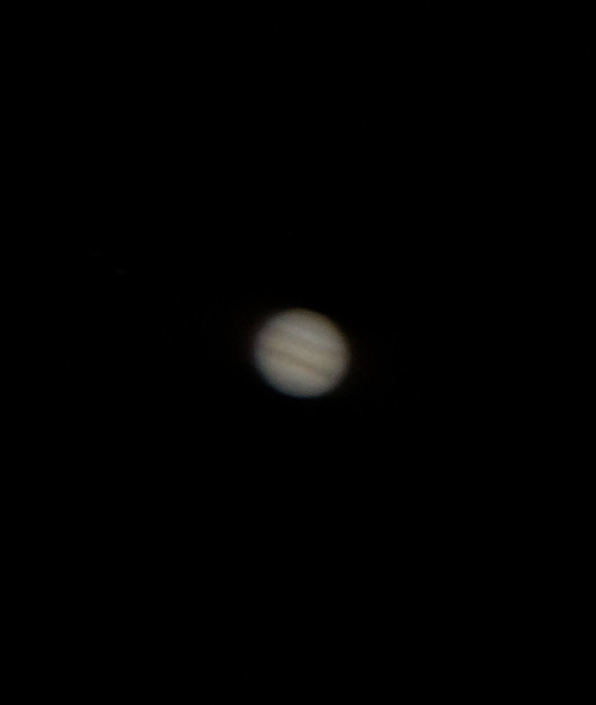
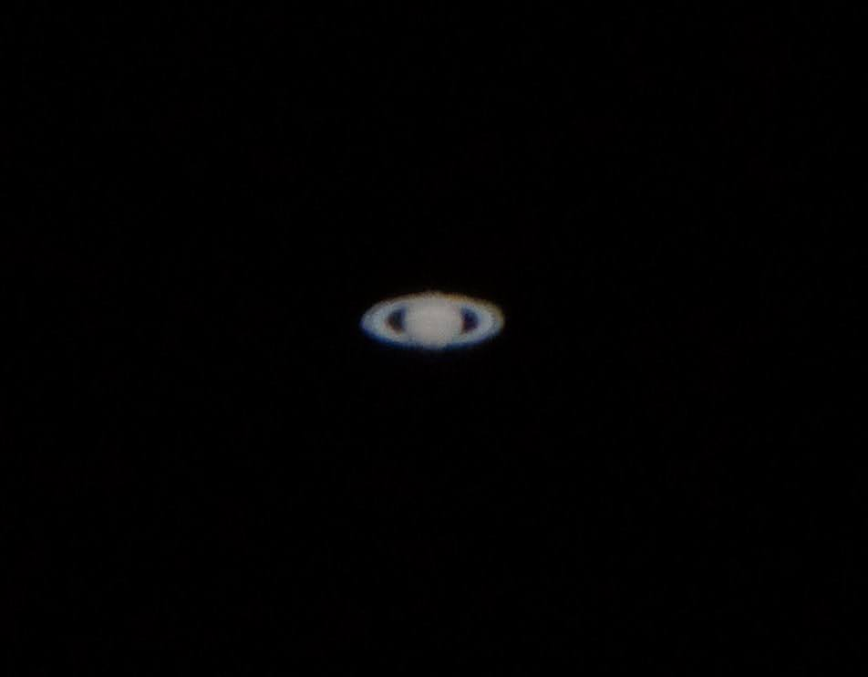
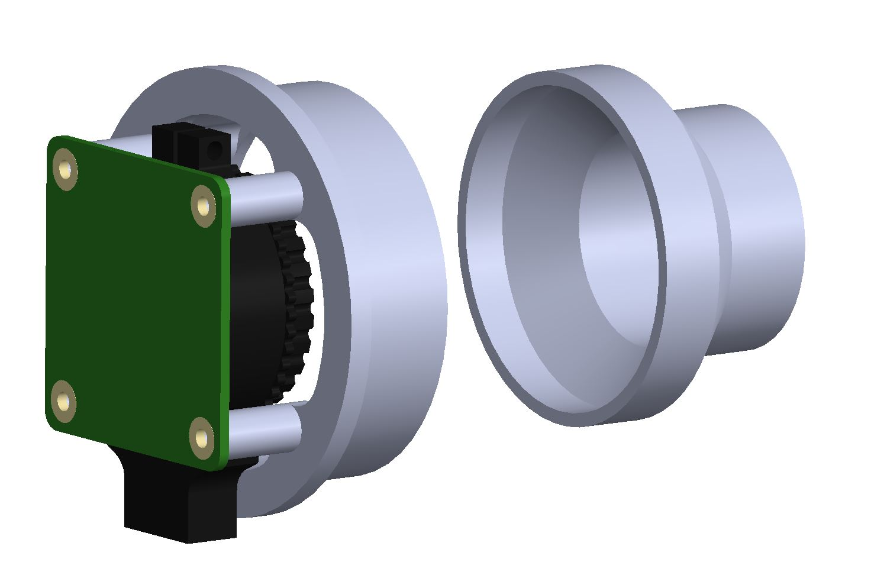
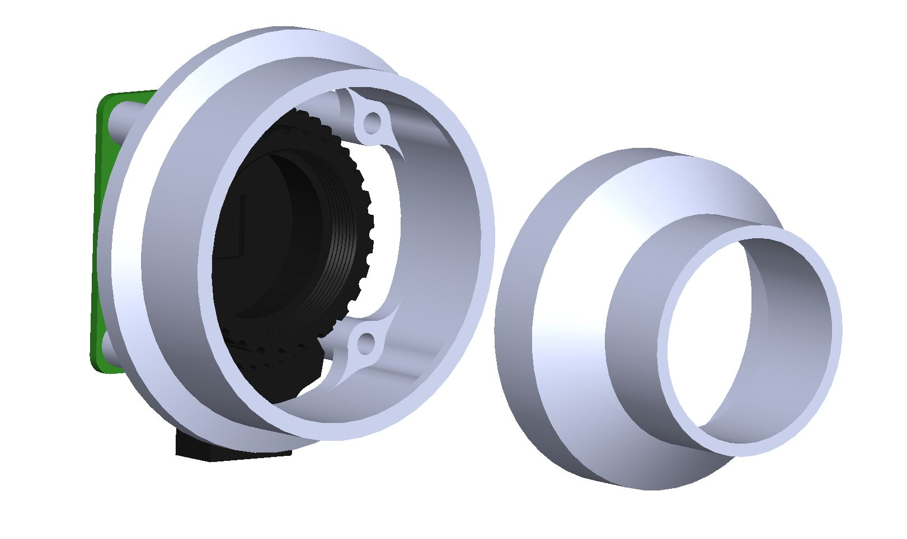
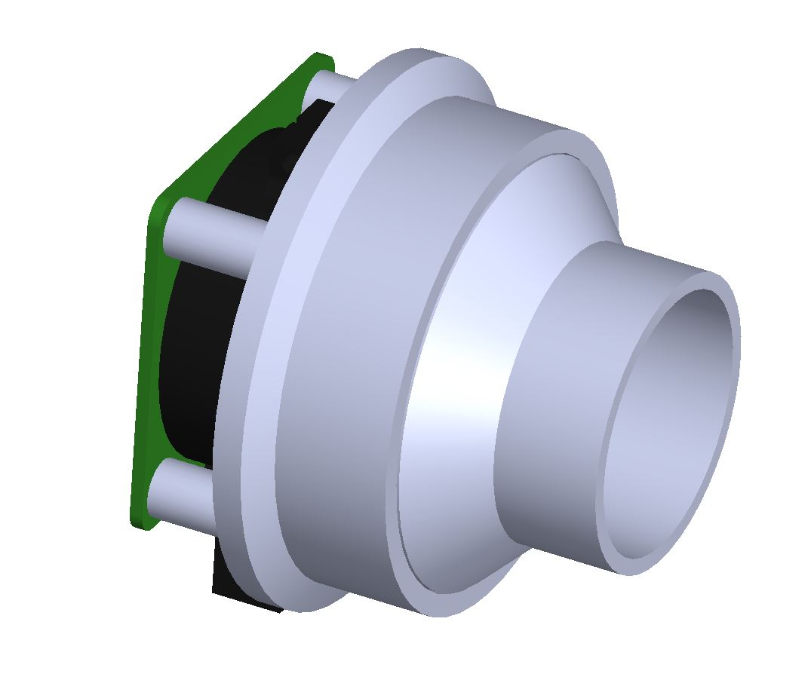

# Astro_RPI
Turning the Raspberry Pi into an astrophotography camera platform.

This project currently includes a 3D-printable mount for the Raspberry Pi High Quality Camera to interface with a 2" telescope focuser and a python program to interface with the camera. 

Features include:

- Easy to use command line interface
- Camera previews
- ISO adjustment
- Full resolution jpg image capture
- Configurable profiles for planetary imaging (currently includes Jupiter and Saturn)

### In Action
Using the High Quality Camera, this setup has successfully shot Jupiter and Saturn using a standard 8" dobsonian telescope. Below are images taken directly from Astro_RPI with no stacking performed and little post-processing. These serve as proof-of-concepts of basic imaging capabilities. Image stacking should allow for greater detail.

  

### Mount
The Astro_RPI mount supports a standard 2" barrel. The included 2" to 1.25" adapter allows for use in standard 1.25" barrels. Assembly requires (4) 2.5x20mm screws and nuts.

  
 

[Raspberry Pi HQ Camera model by Yash Turkar](https://grabcad.com/library/raspberry-pi-hq-camera-1)
